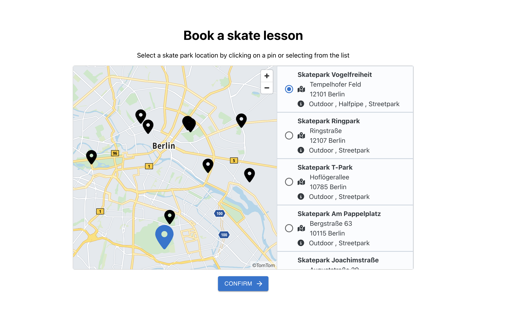

# Book Skate Lessons

This is a MVP use case project to book a skate lesson. I built it with newest up to date frontend technologies and principles.

## Technologies used

- HTML5
- CSS3
- JS
- React
- TypeScript
- Styled components
- MUI component library
- TomTom maps library

## Setup and Run

1. Download the project files
2. Extract all files from the zipped folder
3. Open terminal and run npm install
4. Run npm run start

## Live demo

You can find a live demo [here](https://libormarko.github.io/Book_Skate_Lessons/)

## Screenshot of the webpage

